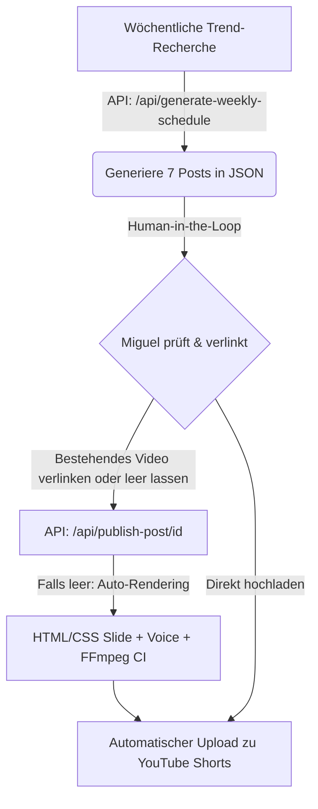

# 🚀 MIMAROS: Wöchentlicher Content- & Veröffentlichungs-Workflow

Dieses Dokument beschreibt den vollautomatisierten Prozess zur Trend-Recherche, Asset-Erstellung und Veröffentlichung deiner YouTube Shorts / Reels im Mimaros Corporate Design.

---

## ⚙️ Workflow-Übersicht



---

## 1. Wöchentliche Analyse starten (Scouting & Planung)
Triggere jeden Montag den Endpunkt `/api/generate-weekly-schedule`. Gemini Pro scannt dann die B2B-Trends, teilt sie in die 4 Funnel-Phasen auf und erstellt 7 neue Post-Entwürfe in deiner `mimaros_publication_schedule.json`.

* **API-Aufruf (PowerShell):**
  ```powershell
  Invoke-RestMethod -Uri http://localhost:8000/api/generate-weekly-schedule -Method Post
  ```
* **Auswirkung:**
  Die Datei `mimaros_publication_schedule.json` wird automatisch um 7 neue Beiträge für die kommende Woche mit dem Status `"draft"` erweitert.

---

## 2. Inhalte verlinken (Human-in-the-Loop)
Öffne die [mimaros_publication_schedule.json](file:///C:/Users/Miguel/mimaros_publication_schedule.json) und prüfe die Entwürfe. Du hast zwei Möglichkeiten:

1. **Vollautomatische Generierung nutzen:** Lasse das Feld `"video_asset"` leer oder auf dem Standardpfad. Das System rendert das Video bei der Veröffentlichung komplett autonom basierend auf dem Skript und dem HTML-Slide.
2. **Eigenes Video verlinken (Personal Brand):** Wenn du ein eigenes Video aufgenommen hast, trage den absoluten Pfad zu deiner `.mp4`-Datei im Feld `"video_asset"` ein. Zum Beispiel:
   ```json
   "video_asset": "C:/Users/Miguel/Videos/mein_video.mp4"
   ```

---

## 3. Vollautomatisch Veröffentlichen (Rendering & Upload)
Sobald du bereit bist, einen Post zu veröffentlichen, feure den Publish-Befehl ab. Das System übernimmt ab hier alles: Untertitel, Logo, CI-Rahmen, Beschreibungstext, Folgebutton und den Upload zu YouTube Shorts.

* **API-Aufruf (PowerShell):**
  ```powershell
  # Ersetze die ID durch die ID des jeweiligen Beitrags aus der JSON
  Invoke-RestMethod -Uri http://localhost:8000/api/publish-post/1784541700000 -Method Post
  ```
* **Vollautomatische Schritte im Hintergrund:**
  1. **Prüfung:** Liegt am angegebenen Pfad ein fertiges Video?
  2. **Render-Schleife (falls kein Video vorliegt):** Die `html_render_engine.py` rendert das Bento-Grid im Mimaros-CI. `edge-tts` vertont das Skript.
  3. **Branding & Subs:** FFmpeg brennt Untertitel, das Logo und den CI-Rahmen ein.
  4. **YouTube-Uploader:** Das Video wird mit der hinterlegten Beschreibung, dem Titel und den Tags auf YouTube hochgeladen.
  5. **Status-Update:** Der Post-Status in der JSON-Datei wird auf `"published"` gesetzt.
